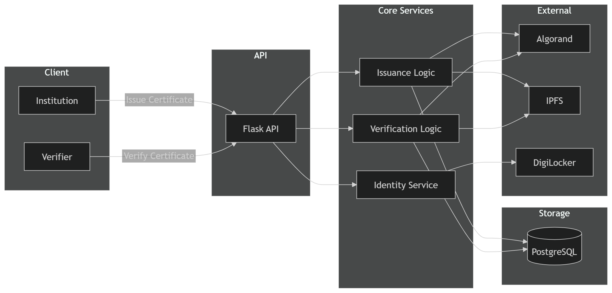

# SkillChain

> **Blockchain-anchored credential verification** built on Algorand, IPFS, and W3C Decentralised Identifiers (DIDs), designed to be confirmed via DigiLocker (currently running in mock mode)

---

## 🌐 Live Deployment

SkillChain is currently deployed and running.

🔗 **Live API:**  
https://skillchain11-production.up.railway.app/

### Key Endpoints

- POST `/issue`
- POST `/verify`
- GET `/health`

> Current deployment runs in single-worker mode to maintain queue consistency.

## 📌 Response to Panel Feedback

This README was restructured in direct response to panel feedback received after the initial submission. Every point has been addressed explicitly:

| Panel Feedback | What Was Added / Changed |
|---|---|
| **"Provide a more complete project description"** | Expanded [Project Overview](#-project-overview) with problem, solution, Why Algorand, and key differentiator sections |
| **"Clearly define user flows"** | New [User Flows](#-user-flows) section with four step-by-step flows covering issuance, verification, onboarding, and identity binding |
| **"Clearly define MVP scope"** | New [MVP Scope](#-mvp-scope-next-30-days) section with explicit included/deferred split |
| **"Explain how transaction volume will be driven on Algorand"** | New [Transaction Volume Strategy](#-driving-transaction-volume-on-algorand) section with concrete drivers and use-case mapping |
| **"Focus on achievable milestones for the next month"** | [MVP Scope](#-mvp-scope-next-30-days) and [Roadmap](#-roadmap) sections grounded in what is already built |
| **"Show explicitly that feedback was understood and incorporated"** | This table. Every section added maps to a specific panel comment |
| **"Include a proposed architecture plan"** | New [Proposed Architecture Plan](#-proposed-architecture-plan) section with evolution roadmap and diagram placeholder |

---

## 📋 Table of Contents

1. [Project Overview](#-project-overview)
2. [User Flows](#-user-flows)
3. [MVP Scope (Next 30 Days)](#-mvp-scope-next-30-days)
4. [Driving Transaction Volume on Algorand](#-driving-transaction-volume-on-algorand)
5. [System Architecture](#system-architecture)
6. [Proposed Architecture Plan](#-proposed-architecture-plan)
7. [Feature Inventory](#feature-inventory)
8. [Security Evaluation](#security-evaluation)
9. [Development Evolution](#development-evolution)
10. [Production Analysis](#production-analysis)
11. [Roadmap](#-roadmap)
12. [Tech Stack](#tech-stack)
13. [API Surface](#api-surface)

---

## 🔷 Project Overview

### The Problem

Academic and professional credentials are trivially forgeable. A fraudulent certificate is indistinguishable from a real one to any employer or institution that cannot directly contact the original issuer — a process that is slow, manual, and increasingly unreliable as institutions merge, close, or go offline.

Existing verification systems are centralised and fragile. They depend on the issuing institution remaining operational and responsive. If a college shuts down, every certificate it ever issued becomes unverifiable. There is no independent, persistent record that survives the institution.

Beyond authenticity, there is a second unsolved problem: **ownership**. Even a verified certificate cannot prove that the person presenting it is the person it was issued to. A stolen PDF passes every traditional check.

### The Solution

SkillChain anchors a cryptographic fingerprint (SHA-256 hash) of every certificate directly on the Algorand blockchain at the moment of issuance. Verification does not require contacting the issuing institution — it requires only the original certificate file and public blockchain state, both of which are permanently and independently available.

The identity layer solves the ownership problem: SkillChain binds each certificate to a DigiLocker-verified, Aadhaar-backed identity DID. Verification confirms not just that a certificate is authentic, but that the person presenting it is the person it was issued to — confirmed by a government identity authority.

### Why Algorand

Algorand is the right blockchain for this use case on four counts:

- **Near-instant finality (~3.5s)**: Certificate issuance is synchronous — the API confirms anchoring in real time, not eventually. Users get a transaction ID immediately.
- **Sub-cent transaction cost**: At scale (universities issuing thousands of certificates per cohort), transaction cost is not a barrier. A 10,000-certificate batch costs under $5 in transaction fees.
- **No forks, no re-orgs**: Algorand's Pure Proof-of-Stake consensus produces immediate, irreversible finality. An anchored certificate cannot be rolled back.
- **IPFS-linked transaction notes**: Algorand's note field carries a compact JSON payload linking each transaction to full IPFS metadata — enabling rich credential records without bloating the chain.

### Key Differentiator

Most blockchain credential systems verify *documents*. SkillChain verifies *documents + identity*. The DigiLocker integration creates a tamper-proof chain: institution → signed certificate → anchored hash → identity DID → Aadhaar-verified person. Every link is independently verifiable. No centralised authority can invalidate it.

---

## 🔄 User Flows

### 1. Institution Onboarding Flow

```
Institution submits name + email + domain
        ↓
System sends email verification token
        ↓
Institution clicks verification link → email confirmed
        ↓
Admin reviews pending registration (/admin/pending)
        ↓
Admin approves (/admin/approve/<id>)
        ↓
System generates:
  - W3C DID (did:skillchain:<sha256_prefix>)
  - Algorand wallet keypair
  - Ed25519 signing keypair
  - API key (returned once, plaintext never stored)
        ↓
Institution receives API key → ready to issue certificates
```

### 2. Certificate Issuance Flow

```
Institution sends certificate file + metadata → POST /issue (X-API-Key)
        ↓
Flask API validates API key → looks up institution DID
        ↓
algorand_service:
  - Opens image via PIL → clears EXIF metadata
  - Converts to PNG → SHA-256 hash
        ↓
signing_service:
  - Fetches Ed25519 private key (Vault or AES-GCM)
  - Signs certificate hash
  - Deletes key from memory (try/finally)
        ↓
ipfs_service:
  - Constructs metadata object (hash, signature, HMAC, issuer DID, etc.)
  - Pins to IPFS via Pinata → receives CID
        ↓
algorand_service:
  - Creates zero-value PaymentTxn (self-send)
  - Note field: {"sc":"1","cid":"<ipfs_cid>","wv":<wallet_version>}
  - Submits → waits for block confirmation (4 rounds)
        ↓
PostgreSQL: row written to certificates table
        ↓
API returns: { tx_id, ipfs_cid, cert_hash, trust_score }
```

### 3. Certificate Verification Flow

```
Verifier uploads certificate file → POST /verify (no auth required)
        ↓
Flask API re-derives SHA-256 hash from normalised file bytes
        ↓
Fast path (DB hit):
  cert_hash → certificates table → tx_id → Algorand indexer
        ↓
Fallback path (DB miss):
  Algorand indexer scan across institution transactions
  → IPFS metadata fetch for hash match
        ↓
_verify_full():
  1. IPFS metadata retrieved (Pinata → Cloudflare → ipfs.io fallback)
  2. HMAC recomputed server-side → compare_digest against stored value
  3. Ed25519 signature verified against institution public key
  4. Issuer revocation status checked in did_registry
  5. Algorand transaction confirmed in block
        ↓
compute_trust_score() → weighted composite (0–100, grade A–F)
        ↓
API returns: { valid, trust_score, grade, tx_id, issuer_did, issued_to, ... }
```

### 4. Identity Binding Flow (DigiLocker)

```
User initiates → POST /digilocker/start (provides name)
        ↓
digilocker_service creates session → returns request_id + redirect URL
        ↓
User completes DigiLocker consent (Aadhaar-backed)
        ↓
GET /digilocker/callback → session status updated
        ↓
POST /digilocker/verify → POST /digilocker/bind
        ↓
identity_service.bind_identity():
  name_hash     = SHA-256(name.strip().lower())
  identity_did  = did:skillchain:identity:<SHA-256(digilocker_id:name_hash)[:16]>
        ↓
Row written to identity_anchors (idempotent)
        ↓
identity_did stored in certificates.issued_to at issuance
        ↓
At verification: hmac_lib.compare_digest(claimant_did, cert_issued_to_did)
        ↓
Result: { identity_verified: true/false, identity_did }
```

> **Note on mock mode**: The DigiLocker flow currently uses a mock implementation with clearly marked production swap points. All downstream logic — identity binding, DID derivation, and ownership verification — is production-ready code running against mock data. Activating real DigiLocker requires replacing two private helper functions only.

---

## 🎯 MVP Scope (Next 30 Days)

The system is functionally complete but not yet production-hardened. This section defines what constitutes a complete, demonstrable MVP and what is intentionally deferred.

### ✅ Included in MVP

| Feature | Status | Notes |
|---|---|---|
| Certificate issuance (single) | **Complete** | `/issue` endpoint, EXIF-normalised, SHA-256 anchored |
| Certificate verification | **Complete** | Full trust score, HMAC + Ed25519 + chain confirmation |
| Batch issuance (up to 500) | **Complete** | In-memory queue, background thread, polling endpoint |
| Institution DID onboarding | **Complete** | 3-stage flow: register → verify email → admin approve |
| W3C DID Document resolution | **Complete** | `/did/<path:did>`, `application/did+ld+json`, HTTP 410 on revoke |
| Identity binding (mock DigiLocker) | **Complete** | Mock with production swap points; DID derivation is live |
| Ed25519 credential signing | **Complete** | Per-institution keys, signing isolation via signing_service |
| IPFS metadata pinning | **Complete** | Pinata + 3-gateway fallback |
| Issuer revocation | **Complete** | Admin-gated, propagates to all verification responses |
| Trust score engine | **Complete** | 4-signal weighted composite, A–F grade |
| PostgreSQL persistence | **Complete** | 4-table schema, idempotent migrations, Railway-deployed |
| Rate limiting + CORS | **Complete** | Flask-Limiter, per-endpoint limits |
| Dev key management (AES-256-GCM) | **Complete** | Encrypted keys in DB for non-Vault deployments |

### 🔜 Stretch Goals Within 30 Days

| Feature | Status | Notes |
|---|---|---|
| HashiCorp Vault integration (production) | **Built, ready** | Vault client complete; requires a provisioned Vault server |
| Live DigiLocker (Setu sandbox) | **Swap-ready** | Replace 2 helper functions; no other changes needed |
| Frontend dashboard (institution + verifier) | **Partial** | Basic UI exists; needs polish |

### ❌ Not in MVP (Explicitly Deferred)

| Feature | Reason for Deferral |
|---|---|
| ARC4 on-chain DID registry (smart contract) | Contract built and tested; integration deferred to avoid latency + cost overhead in early-stage demo |
| Celery + Redis batch queue | In-memory queue sufficient for single-process demo; replacement required before multi-worker production |
| Full DigiLocker production (Setu live API) | Requires approved Setu credentials; architecture is ready |
| Versioned HMAC / key rotation | Requires IPFS re-pinning workflow; not a demo blocker |
| Algorand mainnet deployment | Testnet demonstrates all functionality; mainnet requires funded wallets |
| ML-assisted institution approval | Designed as extension point; not critical for MVP trust guarantees |

---

## 📈 Driving Transaction Volume on Algorand

SkillChain's design creates a direct, structural relationship between real-world credential activity and on-chain transaction volume. This is not speculative — every issuance event maps to exactly one Algorand transaction.

### Transaction Events Per Operation

| Operation | Algorand Transactions |
|---|---|
| Single certificate issuance | 1 (anchoring PaymentTxn) |
| Batch of 500 certificates | 500 (one per certificate) |
| Issuer revocation | 1 (future: on-chain revocation record) |
| DID registration (on-chain, post-MVP) | 1 (ARC4 contract call + Box Storage write) |
| DID update / key rotation (post-MVP) | 1 per update |

### Primary Volume Drivers

**Universities and degree-granting institutions**
A mid-size university graduating 2,000 students per year generates 2,000 anchoring transactions per cohort. At 3 document types per student (degree, transcript, completion certificate), that is 6,000 transactions per institution per year. Ten universities onboarded = 60,000 transactions annually from this segment alone.

**EdTech platforms and MOOCs**
Platforms like Coursera, NPTEL, or Unacademy issue certificates continuously, not in annual batches. A platform issuing 500 certificates per day generates ~180,000 transactions per year per platform. The batch issuance endpoint (up to 500 per call) makes this operationally trivial.

**Professional certification bodies**
Exam boards, skill certification providers (AWS, Google, CompTIA equivalents), and trade certification bodies issue credentials on a rolling basis. These are high-value credentials where forgery risk is highest — making blockchain anchoring most compelling.

**HR and background verification platforms**
Once institutions are onboarded, verification platforms become volume drivers too. Each programmatic verification call creates a read against the chain — and in a future on-chain verification logging model, each verification could itself be a lightweight transaction.

SkillChain is designed for seamless adoption:

- **API-first integration** — institutions can plug into SkillChain without changing their existing systems or workflows.
- **Non-disruptive deployment** — it works alongside current certificate issuance systems, not as a replacement.

### Why Algorand's Economics Make This Viable

- **~0.001 ALGO per transaction** (~$0.0002 at current prices): A 10,000-certificate batch costs under $2 in transaction fees. No other enterprise blockchain makes bulk anchoring this affordable.
- **4-second finality**: Synchronous issuance is possible. The API blocks for confirmation and returns a transaction ID in real time — no eventual consistency, no polling required from the issuer.
- **Indexer API**: Algorand's indexer enables the fallback verification path (hash scan across institution transactions) without requiring SkillChain to maintain a separate indexing service.

### Volume Projection (Conservative)

| Scenario | Institutions | Certs/Year | Algorand Txns/Year |
|---|---|---|---|
| Pilot (3 months) | 3–5 | ~5,000 | ~5,000 |
| Early traction (Year 1) | 20–30 | ~50,000 | ~50,000 |
| Growth (Year 2) | 100+ | ~500,000 | ~500,000+ |

Post-MVP, adding on-chain DID registration and revocation multiplies transaction count per institution without requiring any new certificate volume.This configuration is sufficient for a complete end-to-end demo: onboarding → issuance → verification → identity binding

---

## System Architecture

### High-Level Architecture

<p align="center">
  
</p>
 


### Component Map

```
                          ┌──────────────────────────────────────────┐
                          │               Flask API (app.py)          │
                          │  Rate-limited, CORS-enabled, admin-gated  │
                          └──────┬──────────────┬────────────┬────────┘
                                 │              │            │
               ┌─────────────────▼──┐   ┌──────▼──────┐  ┌─▼──────────────┐
               │  algorand_service  │   │ did_service  │  │identity_service│
               │  anchor_hash()     │   │ register_did │  │ bind_identity  │
               │  verify_hash()     │   │ validate_key │  │ verify_owns    │
               │  trust_score()     │   │ sign_cred    │  └────────────────┘
               └────────┬───────────┘   └──────┬───────┘
                        │                      │
           ┌────────────▼──────┐   ┌───────────▼────────────────┐
           │   Algorand Node   │   │      signing_service        │
           │  (testnet via     │   │  Vault → fetch key → sign   │
           │   Algonode.cloud) │   │  → del key (scope-limited)  │
           └────────┬──────────┘   └──────┬─────────────────────┘
                    │                     │
           ┌────────▼──────────┐   ┌──────▼───────────────────┐
           │   ipfs_service    │   │   vault_client / key_vault│
           │  Pinata + 3-GW    │   │   HashiCorp Vault (prod)  │
           │  fallback chain   │   │   AES-256-GCM DB (dev)    │
           └────────┬──────────┘   └──────────────────────────┘
                    │
           ┌────────▼──────────┐
           │   PostgreSQL      │
           │  certificates     │
           │  did_registry     │
           │  pending_reg.     │
           │  identity_anchors │
           └───────────────────┘
```

### Backend Structure

The application is a Flask API with eight Python service modules, each with a single responsibility:

- **algorand_service.py** — certificate hashing, Algorand anchoring, trust scoring, and verification
- **did_service.py** — institution DID registration, API key lifecycle, Ed25519 credential signing, email verification
- **digilocker_service.py** — DigiLocker session management (mock with production-swap points)
- **identity_service.py** — DigiLocker-to-DID binding, identity ownership verification
- **signing_service.py** — secure private-key operations (fetch → sign → delete pattern)
- **vault_client.py** — HashiCorp Vault KV v2 integration for key storage
- **ipfs_service.py** — Pinata pinning with three-gateway retry fallback
- **queue_service.py** — in-memory batch anchoring queue with background thread
- **validation_service.py** — multi-layer credential validation pipeline inspired by Decouchant et al., combining cryptographic verification, issuer trust evaluation, and identity binding checks

### Database Design

Four PostgreSQL tables:

**certificates** — one row per anchored certificate. Stores `cert_hash` (SHA-256), `tx_id`, `doc_type`, `issued_at`, `ipfs_cid`, `cert_number`, and `issued_to` (an `identity_did`, not a name hash — changed in the April 10–11 refactor). The HMAC value is intentionally absent from this table; it lives only in IPFS metadata to prevent a known-plaintext corpus from sitting next to the data it protects.

**did_registry** — one row per approved institution. Stores the W3C DID, institution name, Algorand wallet address, Ed25519 public key, API key (SHA-256 hashed), encrypted private key for dev mode, Vault key version indicator (`wallet_version`), and revocation fields.

**pending_registrations** — institutions awaiting admin approval. Has an email verification token column and a double-guard (`verified` + `approved`) to prevent premature activation.

**identity_anchors** — one row per DigiLocker-verified person. Stores `identity_did` (derived deterministically from `digilocker_id` + `name_hash`), `name_hash` (SHA-256 of normalised name — raw PII never stored), and `bound_at` timestamp.

Schema migrations are idempotent — `run_migrations()` uses `pg_advisory_lock` to prevent race conditions during multi-worker startup on Railway, adds columns with `IF NOT EXISTS` guards, and never drops data.

### Blockchain Interaction

Every certificate issuance creates a zero-value `PaymentTxn` (self-send) on Algorand testnet. The transaction note field carries a compact JSON payload:

```json
{"sc": "1", "cid": "<ipfs_cid>", "wv": <wallet_version>}
```

This note links the on-chain transaction to the IPFS metadata object that contains the full certificate record. The `wait_for_confirmation(client, tx_id, 4)` call makes issuance synchronous — the API does not return until the transaction is confirmed in a block.

Verification has two paths:

- **Fast path**: DB lookup by `cert_hash` → direct indexer fetch by `tx_id`
- **Fallback**: Algorand indexer search across all institution transactions, scanning IPFS metadata for hash match

Both paths include a primary/fallback indexer pattern (Algonode → Algoexplorer) with retry and exponential backoff.

### IPFS Usage

Certificate metadata is pinned to IPFS via Pinata on issuance. The metadata object includes `cert_hash`, `doc_type`, `issued_by`, `issuer_did`, `issued_at`, Ed25519 signature, `hmac_value`, `cert_number`, and `issued_to`. Raw PII is never included — names are hashed before reaching this layer.

Retrieval falls through three gateways in order: Pinata (authenticated), Cloudflare IPFS, and ipfs.io. If all three fail, verification returns a structured error rather than a false negative.

### Identity Layer

The DigiLocker flow is designed to produce a government-backed identity binding:

```
User completes DigiLocker consent
        ↓
digilocker_service extracts: {digilocker_id, name}
        ↓
identity_service.bind_identity()
    name_hash     = SHA-256(name.strip().lower())
    identity_did  = did:skillchain:identity:<SHA-256(digilocker_id:name_hash)[:16]>
        ↓
Row written to identity_anchors (idempotent)
        ↓
identity_did stored in certificates.issued_to at issuance
        ↓
At verification: hmac_lib.compare_digest(claimant_did, cert_issued_to_did)
```

The DID derivation is deterministic — the same DigiLocker user always gets the same identity DID, making the system resilient to session loss. The constant-time comparison in `verify_identity_owns_cert` prevents timing-oracle attacks.

### DID Resolution

Institution DIDs follow the pattern `did:skillchain:<sha256_prefix>` and comply with W3C DID Core 1.0. The `/did/<path:did>` endpoint constructs the DID Document directly from `did_registry` at request time — it does not depend on a pre-generated cache. The document includes Ed25519 verification methods, authentication/assertionMethod arrays, a SkillChainIssuer service endpoint, and a LinkedDomains entry. Content-Type is set to `application/did+ld+json`.

An on-chain ARC4 smart contract (`DIDRegistry` in `smart_contracts/did_contract.py`) exists and stores DID documents in Algorand Box Storage, with per-institution write access controlled by transaction sender identity. This contract is not yet integrated into the main application flow — it operates as a parallel proof-of-concept.

The DID system follows a registry pattern, where each institution’s identity is keyed by its wallet address. This enables efficient indexer-based queries and avoids full transaction scans, making identity resolution scalable as the number of issuers grows.

### Validation Layer (Decouchant Model Alignment)

SkillChain's verification pipeline follows a multi-layer validation approach inspired by Decouchant's research on decentralised trust systems. Rather than relying on a single signal, verification is composed of independent layers:

1. **Cryptographic integrity** — SHA-256 hash matching and HMAC recomputation ensure the certificate has not been altered.
2. **Provenance verification** — Ed25519 signatures confirm issuance by a valid institution DID.
3. **Anchoring layer** — Algorand transaction inclusion guarantees temporal integrity and immutability.
4. **Identity binding** — DigiLocker-derived identity DIDs confirm ownership of the credential.
5. **Issuer state validation** — revocation status and registry presence are checked at verification time.

These layers are evaluated independently and aggregated into the trust score, preventing any single point of failure from compromising verification correctness.

---

## 🏗 Proposed Architecture Plan

[**View Detailed Architecture Diagram →**](#) *(link to be added — diagram in progress)*

### Current State (Deployed)

```
Flask (single worker)
    ├── PostgreSQL (Railway managed)
    ├── Algorand testnet (Algonode)
    ├── IPFS (Pinata + public gateways)
    ├── In-memory batch queue (threading.Thread)
    └── AES-256-GCM key storage (dev) / HashiCorp Vault (prod-ready)
```

### Phase 2: Production Hardening (Month 2)

```
Flask → Gunicorn (multi-worker)
    ├── PostgreSQL (unchanged)
    ├── Algorand testnet → mainnet
    ├── IPFS (Pinata paid SLA)
    ├── In-memory queue → Celery + Redis
    │       └── Durable job persistence, retry, dead-letter queue
    └── HashiCorp Vault (mandatory, no dev fallback)
```

The primary change from current to Phase 2 is the batch queue. Replacing `queue_service.py` with Celery + Redis removes the single-process constraint, enables horizontal scaling, and adds job persistence across restarts. Everything else in the current architecture is already production-grade.

### Phase 3: Full Decentralisation (Month 3+)

```
Flask (API layer only — no state)
    ├── Algorand mainnet
    │       ├── Certificate anchoring (current)
    │       ├── ARC4 DID Registry contract (on-chain institution registry)
    │       └── Revocation records (on-chain)
    ├── IPFS (pinned metadata — unchanged)
    ├── PostgreSQL (cache layer only — not source of truth)
    └── Live DigiLocker via Setu (2-function swap)
```

The ARC4 smart contract (`smart_contracts/did_contract.py`) is already written and tested. Phase 3 wires it into the approval flow, replacing the PostgreSQL `did_registry` table as the authoritative DID source. The database becomes a read cache, not a trust anchor.

---

## Feature Inventory

### Certificate Issuance (`/issue`)

**What it does:** Accepts a certificate file, normalises it, computes its SHA-256 hash, signs it with the institution's Ed25519 key, anchors the hash on Algorand, and pins metadata to IPFS.

**Implementation:** PIL opens the image, clears EXIF metadata (`img.getexif().clear()`), converts to RGB, serialises to PNG in-memory, then SHA-256 hashes the bytes. EXIF clearing ensures the hash is stable across re-saves. The file bytes are deleted from memory after hashing.

**Location:** `app.py → issue()`, `algorand_service.py → anchor_hash()`

**Constraints:** Requires the institution wallet to hold at least 200,000 microAlgos (`is_wallet_ready` check). Rate-limited to 10 requests per minute. Only processes files named in the request — empty filenames are rejected.

---

### Certificate Verification (`/verify`)

**What it does:** Accepts a certificate file, re-derives its hash, looks it up in the DB and on-chain, checks IPFS metadata integrity, recomputes the HMAC, checks issuer revocation, verifies the Ed25519 signature, and returns a composite trust score.

**Implementation:** Trust score is a weighted sum across four signals — chain confirmation (35 points), HMAC validity (25), Ed25519 signature (25), issuer not revoked (15) — with a +5 bonus for wallet version 2 (per-institution key). HMAC is recomputed from the env secret on every verification call; the stored IPFS value is compared with `hmac.compare_digest` (timing-safe).

**Location:** `algorand_service.py → verify_hash()`, `_verify_full()`, `compute_trust_score()`

**Constraints:** IPFS metadata fetch can fail if all three gateways are unavailable. Falls back to indexer scan if cert is not in local DB, which is slower and depends on Algorand indexer availability.

---

### Batch Issuance (`/issue/batch`)

**What it does:** Accepts a ZIP file of up to 500 certificates, hashes all of them synchronously, then queues Algorand anchoring as a background job. Returns immediately with a `batch_id` and a status polling URL.

**Implementation:** A module-level `threading.Thread` drains a `collections.deque` in a 2-second polling loop. Results accumulate in a dict keyed by `batch_id`. A `metadata.json` file inside the ZIP can pre-assign cert numbers and holder names. Files prefixed with `__MACOSX` are skipped.

**Location:** `app.py → issue_batch()`, `queue_service.py`

**Constraints:** Queue state is in-memory — a worker restart loses all queued and in-progress jobs. The current deployment runs in single-worker mode to maintain queue consistency. Not safe for multi-worker deployments.
---

### Institution Registration and DID Onboarding

**What it does:** Three-stage flow — institution submits name/email/domain → email token verification → admin approval → DID registration and wallet provisioning.

**Implementation:** Registration tokens are `secrets.token_hex(16)`. API keys are `secrets.token_hex(32)`, SHA-256 hashed before DB storage; the plaintext key is returned once and never re-stored. Institution names are normalised (`strip().lower()` + whitespace collapse) before all DB operations to prevent duplicate registrations under different capitalisation. On approval, a fresh Algorand keypair is generated and either stored in Vault (production) or AES-256-GCM encrypted in `did_registry` (dev mode).

---

### Intelligent Institution Approval (ML Decision Layer)

**What it does:** Augments the manual admin approval process with a machine learning–assisted decision layer to evaluate institution legitimacy.

**Design intent:** The ML layer does not replace admin control — it acts as a decision-support system, reducing human bias and scaling onboarding without weakening trust guarantees. It operates on institution metadata (domain reputation, historical issuance patterns, registry consistency, and anomaly signals) to assign a risk score and recommend approval or rejection.

**Status:** Designed as an extension point over the existing `pending_registrations` workflow. Not yet active in production.

**Location:** `app.py`, `did_service.py → request_registration()`, `approve_registration()`

**Constraints:** `DEMO_MODE` must be explicitly set — the application refuses to start with an unset value. Admin operations are gated by `X-Admin-Key` header comparison against an env-provided `ADMIN_KEY`.

---

### DigiLocker Identity Binding (`/digilocker/*`)

**What it does:** Initiates a DigiLocker consent session, receives the authenticated user identity, and creates or retrieves a deterministic identity DID.

**Implementation:** Currently operates in mock mode — real Setu API calls are replaced by two private helper functions (`_mock_create_request`, `_mock_get_status`) with clearly marked swap points. The session store (`_FAKE_DIGILOCKER_DB`) is module-level in-memory. The `/digilocker/start` endpoint accepts a user-provided `name` field and stores it against the `request_id`; no hardcoded identity values exist in the codebase.

**Location:** `digilocker_service.py`, `app.py → digilocker_start()`, `digilocker_verify()`, `digilocker_bind()`

**Constraints:** In-memory session store does not survive server restarts.

---

### Key Management and Signing (`signing_service.py`, `vault_client.py`)

**What it does:** Abstracts all private key operations so keys never exist outside the innermost signing scope.

**Implementation:** `sign_transaction()` and `sign_credential_hash()` follow a fetch → use → del pattern with `try/finally` guaranteeing deletion even on exceptions. When `VAULT_ENABLED=true`, keys are fetched from HashiCorp Vault KV v2 at `secret/skillchain/{institution_id}` with no fallback. When `VAULT_ENABLED=false`, per-institution keys are AES-256-GCM decrypted from `did_registry`.

**Security note:** Vault usage is strict and non-optional in production mode. When enabled, private keys never exist in application memory outside the immediate signing scope and are never persisted in the database.

**Location:** `signing_service.py`, `vault_client.py`, `key_vault.py`

---

### W3C DID Document Resolution (`/did/<path:did>`)

**What it does:** Resolves a SkillChain DID to a W3C-compliant DID Document with verification methods, authentication arrays, and service endpoints.

**Implementation:** Document is constructed at request time directly from `did_registry` — no pre-generation cache required. Revoked DIDs return HTTP 410. Invalid DID format returns 400 (regex-validated). Content-Type is `application/did+ld+json`.

---

### Trust Score Engine

**What it does:** Produces a 0–100 composite score and A–F grade for every verified credential.

| Signal | Weight |
|---|---|
| Chain confirmed | 35 |
| HMAC valid | 25 |
| Ed25519 signature valid | 25 |
| Issuer not revoked | 15 |
| Per-institution key (v2) | +5 bonus |

**Location:** `algorand_service.py → compute_trust_score()`

---

### Issuer Revocation (`/admin/revoke-issuer/<institution_id>`)

**What it does:** Sets `revoked=1` on a `did_registry` row, with timestamp and reason. All subsequent verifications for certificates issued by that institution return invalid.

**Implementation:** Revocation is checked during `_verify_full()` by querying `did_registry` on the transaction sender address. DID resolution returns HTTP 410 for revoked DIDs.

---

## Security Evaluation

### Implemented Protections

**HMAC tamper-evidence:** HMAC-SHA256 computed server-side from `HMAC_SECRET` and stored only in IPFS metadata — not in the DB alongside the hash it protects. Verification recomputes and compares with `hmac.compare_digest` (timing-safe). The April 10 commit removed an earlier vulnerability where HMAC was stored in the DB.

**Ed25519 provenance signatures:** Every certificate hash is signed with the issuing institution's Ed25519 private key at issuance. Signature stored in IPFS metadata and verified during the `_verify_full` path.

**API key hashing:** Plaintext API keys never persisted. SHA-256 hash stored; DB compromise does not yield usable keys.

**Private key scoping:** `signing_service.py` fetch-sign-del pattern. Keys exist only within the signing function scope. `try/finally` guarantees deletion on exception paths.

**No PII storage:** Names stored as SHA-256 hashes. Raw DigiLocker names exist only in the in-memory session store (and transiently in the Flask request context). `identity_anchors` stores `name_hash`, not `name`.

**Constant-time identity comparison:** `hmac_lib.compare_digest` used for identity DID comparison, preventing timing oracle attacks.

**Rate limiting:** Flask-Limiter on `/issue` (10/min), `/verify` (30/min), DigiLocker endpoints (20/min), and identity lookup (30/min).

**Startup-time env validation:** `HMAC_SECRET`, `ADMIN_KEY`, `DEMO_MODE`, and `DATABASE_URL` are all checked at import/startup time with `RuntimeError` on absence — no deferred failure at runtime.

**Transaction ID validation:** `is_valid_txid()` rejects demo/placeholder IDs before indexer queries, preventing false verification against non-existent transactions.

### Potential Vulnerabilities

**Low severity:** `ADMIN_KEY` is compared with `==` (not `compare_digest`) — susceptible to timing oracle in theory, though HTTP network jitter dominates in practice.

**Dev-only:** `ensure_mock_session` re-creates sessions with an empty name on server restart. Correctly causes downstream 422 errors rather than silent incorrect bindings. Will be removed when real Setu is integrated.

**Legacy pattern:** In `_verify_full`, the revocation lookup uses an OR condition (`institution_address = %s OR (institution_address IS NULL AND address = %s)`). Harmless given unique address constraints, but flagged for cleanup.

**Smart contract:** The ARC4 smart contract's `revoke` function had a tautological authorisation check (`sender == sender`) in one version. The updated contract in the AlgoKit project corrects this to `sender == self.admin.value`.

---

## Development Evolution

**March 17 — MVP**
Initial commit. Flask + Algorand SDK, SHA-256 normalisation pipeline, frontend UI, SQLite. The normalisation test (`test_normalization.py`) was included from day one — image normalisation correctness was treated as foundational, not an afterthought.

**March 18–19 — Institution Layer and DigiLocker**
DID-gated issuance introduced — institutions must register and be approved before issuing certificates. DigiLocker integration via Setu API added, initially as a live sandbox flow. First form of the identity verification pipeline.

**March 23–24 — Hardening**
Byte note safety guard added to the Algorand transaction note. HMAC implementation added to tamper-evidence chain. Batch issuance with the in-memory queue introduced. Jump from single-cert MVP to institution-scale operation.

**March 28 — IPFS CID Fix**
The IPFS CID was not being correctly embedded in transaction notes. Fixed to use the actual Pinata response CID rather than a placeholder.

**April 2 — Vault and Signing Isolation**
Major security refactor: `signing_service.py` introduced as the sole authority for private-key operations. Private keys extracted from `algorand_service.py` and `did_service.py`. HashiCorp Vault KV v2 integration added via `hvac`. This commit eliminated private key exposure from core services.

**April 3 — Deployment Fixes**
Idempotent PostgreSQL migrations with `pg_advisory_lock`. W3C DID document structure formalised. Vault integration made deployment-safe.

**April 10 — PostgreSQL Migration and Identity Layer**
SQLite removed entirely. All DB access migrated to `psycopg2`. `identity_service.py` introduced. Two security fixes: HMAC vulnerability removed (HMAC value no longer stored in DB), admin authentication hardened. Multi-worker race condition in migrations fixed. DigiLocker moved to mock with explicit production swap points.

**April 11 — HMAC and Identity Refactor**
HMAC strengthened with mandatory `HMAC_SECRET` env var checked at module import time (raises `RuntimeError` if missing). Identity binding refactored: `issued_to` column semantics changed from `name_hash` to `identity_did`. The old `verify_identity_against_cert` (name-hash comparison, susceptible to same-name collisions) replaced by `verify_identity_owns_cert` (constant-time DID string comparison, no collision risk).

**April 12–13 — W3C Compliance and Security Hardening**
DID registry updated to W3C DID Core 1.0 structure. API key storage hardened — keys are now SHA-256 hashed before DB insertion; plaintext is returned once at registration. DigiLocker identity flow made dynamic — hardcoded `_DEMO_USER_NAME` removed. DID resolution endpoint made self-contained.

---

## Production Analysis

### Authentication and API Key Management
API keys are SHA-256 hashed at storage — the DB contains no retrievable plaintext keys. Rate limiting (Flask-Limiter) is applied per remote address. The `ADMIN_KEY` is compared directly (not hashed) — acceptable for an admin-only channel, but a compromised environment variable fully compromises admin access. There is no API key rotation mechanism; revocation requires direct DB manipulation.

### Blockchain Anchoring
The Algorand testnet dependency is the most significant production risk. `wait_for_confirmation(client, tx_id, 4)` blocks the HTTP response for 4 block rounds (~16 seconds worst case) on each `/issue` call. Under load, this makes the endpoint unsuitable as a synchronous API without upstream timeouts. The batch endpoint correctly decouples this, but its in-memory queue is lost on restart.

The fallback indexer pattern handles transient Algonode outages, but if both primary and fallback indexers are down, verification fails with a structured error rather than a false positive. This is the correct failure mode.

### IPFS Dependency
Verification depends on IPFS metadata retrieval. A certificate whose CID has been unpinned from Pinata and evicted from both Cloudflare and ipfs.io caches is unverifiable even if the on-chain transaction is valid. Long-term metadata persistence requires either a dedicated IPFS node or Pinata's paid pinning guarantees.

### Identity Layer
The mock DigiLocker implementation is not a placeholder — it is a correctly architected swap point. The real Setu integration requires only replacing `_mock_create_request` and `_mock_get_status`. All downstream code is production-ready.

### Batch Queue
The `queue_service` threading model is incompatible with multi-process deployment. The queue lives in one process's memory. This requires replacement with Celery + Redis before scaling.

### Key Management
The Vault integration is architecturally sound — fail-hard on unavailability, no silent fallbacks in production mode. The dev-mode AES-256-GCM encryption is a reasonable local substitute. There is no key rotation workflow implemented.

---

## Key Strengths

**HMAC architecture.** Storing the HMAC only in IPFS metadata and recomputing it server-side on every verification eliminates the known-plaintext risk of keeping HMAC values adjacent to the data they protect. This was identified and corrected during development.

**Identity binding is collision-free.** The shift from name-hash comparison (April 10) to identity-DID comparison (April 11) eliminates same-name collisions — two people named "Ravi Kumar" produce identical `issued_to` values under name hashing, but unique DIDs under the DigiLocker ID derivation.

**Production swap architecture.** The DigiLocker mock is a carefully designed interface boundary. The two private helper functions are the only code that changes for production. Route handlers, verification logic, identity binding, and the DID derivation chain are all real production code running against mock data.

**Signing isolation.** Eliminating private key access from all modules except `signing_service.py` means a vulnerability in `algorand_service.py` or `did_service.py` cannot leak key material.

**Deterministic identity DIDs.** `_derive_identity_did` is a pure function of `digilocker_id` and `name_hash`. The same user always gets the same DID across sessions, servers, and time.

**Self-contained DID resolution.** The `/did/<path:did>` endpoint constructs DID Documents directly from PostgreSQL without depending on a pre-generation service. DID resolution continues working even if `w3c_did_service.py` is unavailable.

---

## Limitations

- **DigiLocker is not live.** Production deployment requires Setu sandbox credentials and replacement of two private helper functions.
- **Batch queue is not restart-safe.** Jobs queued but not yet anchored are lost if the Flask process restarts.
- **`issued_to` semantic change is not backward-compatible.** Certificates issued before the April 11 refactor stored a `name_hash` in `issued_to`; certificates issued after store an `identity_did`. A one-time migration is planned.
- **No HMAC key rotation.** Rotating `HMAC_SECRET` invalidates all existing HMAC checks. A versioned HMAC scheme is in the roadmap.
- **Testnet only.** All Algorand addresses and transactions reference testnet. Mainnet migration requires funded institution wallets.
- **Single-process constraint for batch.** Gunicorn multi-worker deployments break the batch queue.

---

## 🗺 Roadmap

| Priority | Item | Effort |
|---|---|---|
| 🔴 High | Replace batch queue with Celery + Redis | Medium |
| 🔴 High | Activate real Setu DigiLocker (2-function swap) | Low |
| 🟡 Medium | Integrate ARC4 DID Registry contract | Medium |
| 🟡 Medium | Versioned HMAC scheme for key rotation | Medium |
| 🟡 Medium | Backfill `issued_to` semantics for pre-April-11 certs | Low |
| 🟢 Low | Algorand mainnet deployment | Low (config change) |
| 🟢 Low | ML-assisted institution approval layer | High |
| 🟢 Low | API key rotation mechanism | Medium |

---

## Tech Stack

| Layer | Technology |
|---|---|
| API framework | Flask, flask-cors, Flask-Limiter |
| Blockchain | Algorand (algosdk), Algonode testnet |
| Smart contracts | AlgoKit, algopy (ARC4, Box Storage) |
| IPFS | Pinata (pinning), multi-gateway fetch |
| Database | PostgreSQL (psycopg2, RealDictCursor) |
| Key management | HashiCorp Vault KV v2 (hvac), AES-256-GCM (dev) |
| Cryptography | Ed25519 (PyNaCl / nacl.signing), HMAC-SHA256, SHA-256 |
| Image processing | Pillow (PIL) |
| Identity | DigiLocker via Setu (mock; production swap-ready) |
| Deployment | Docker, Railway (PostgreSQL managed service) |
| Language | Python 3.11+ |

---

## API Surface

| Method | Endpoint | Auth | Purpose |
|---|---|---|---|
| POST | `/issue` | X-API-Key | Issue a single certificate |
| POST | `/verify` | None | Verify a certificate file |
| POST | `/issue/batch` | X-API-Key | Queue up to 500 certificates |
| GET | `/batch/status/<batch_id>` | X-API-Key | Poll batch anchoring progress |
| POST | `/request-registration` | None | Submit institution for review |
| GET | `/verify-email` | Token (query param) | Confirm institution email |
| GET | `/admin/pending` | X-Admin-Key | List pending registrations |
| POST | `/admin/approve/<id>` | X-Admin-Key | Approve and provision institution |
| POST | `/admin/revoke-issuer/<id>` | X-Admin-Key | Revoke an institution |
| POST | `/digilocker/start` | None | Start DigiLocker consent session |
| GET | `/digilocker/callback` | None | Process DigiLocker callback |
| POST | `/digilocker/verify` | None | Bind DigiLocker identity to DID |
| POST | `/digilocker/bind` | None | Directly bind a DigiLocker identity |
| GET | `/digilocker/identity/<id>` | X-API-Key | Look up identity anchor |
| GET | `/did/<path:did>` | None | Resolve DID to W3C DID Document |
| GET | `/did/view/<path:did>` | None | Human-readable DID viewer |
| GET | `/institution/<path:did>` | None | Institution dashboard |
| GET | `/health` | None | Service health (Vault status) |

---

## Smart Contract (On-Chain DID Registry)

An Algorand ARC4 smart contract (`smart_contracts/did_contract.py`), along with the AlgoKit project under `skill_contracts/`, implements a decentralised DID registry using Algorand Box Storage.

The current system uses a PostgreSQL-backed `did_registry` for DID resolution and management. This choice is deliberate: database-backed reads provide low-latency access and simplify integration with the verification pipeline during early-stage development.

The smart contract represents the decentralised evolution of this layer. Integrating it would replace database operations with on-chain state access and transaction-driven updates. By separating the contract implementation from the active system, the architecture remains production-stable while demonstrating a complete pathway to a fully decentralised registry.

---

*SkillChain — Credentials you can verify without trusting anyone.*
